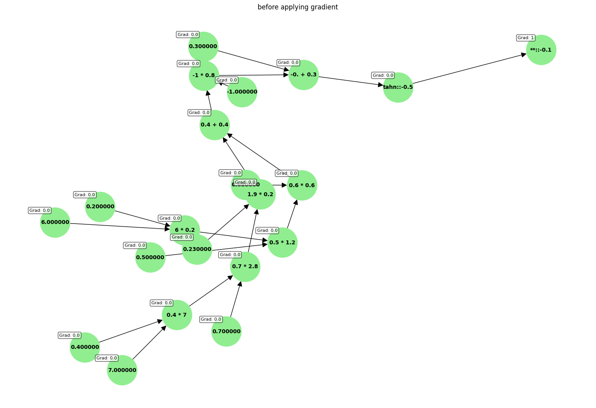

# Neural Network from Scratch

This repository contains an implementation of a neural network built entirely from scratch. It is designed to provide a fundamental understanding of how neural networks operate, including forward and backward propagation, weight updates, and gradient computation. The project is ideal for educational purposes or for anyone looking to deepen their understanding of neural network internals.

## Overview

The project demonstrates key concepts such as:
- **Forward Propagation:** Calculating the output of the neural network based on input features.
- **Backward Propagation:** Computing gradients to optimize the network.
- **Weight Updates:** Adjusting parameters using gradient descent.

Visualization images are included to showcase the gradient updates:
#  Neural network state before applying gradient updates.


# Neural network state after applying gradient updates.

## Getting Started

### Prerequisites
- Python 3.8+
- Jupyter Notebook (optional, for running the tutorial)


### Running the Notebook
The Jupyter notebook (`tutorial.ipynb`) provides a step-by-step demonstration of building and training a neural network. To run it:
1. Start Jupyter Notebook:
   ```bash
   jupyter notebook
   ```
2. Open `tutorial.ipynb` and follow the instructions.

### Key Features
- Modular implementation for easy customization.
- Educational focus, illustrating the mechanics of neural networks.
- Visualizations for understanding gradient effects.

## Future Work
- Add support for different optimizers (e.g., Adam, RMSprop).
- Implement additional activation functions and loss metrics.
- Extend the notebook with more examples and exercises.

## Contributions
Contributions are welcome! Feel free to open issues or submit pull requests for improvements or new features.

## License
This project is licensed under the MIT License. See the LICENSE file for details.

## Acknowledgments
- Inspired by foundational concepts in machine learning and neural networks.
- Special thanks to the online community for resources and support.
